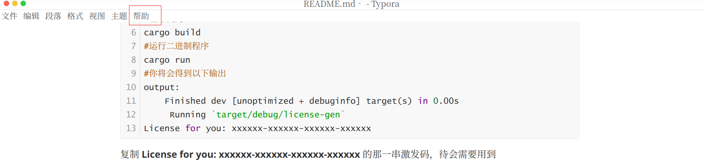
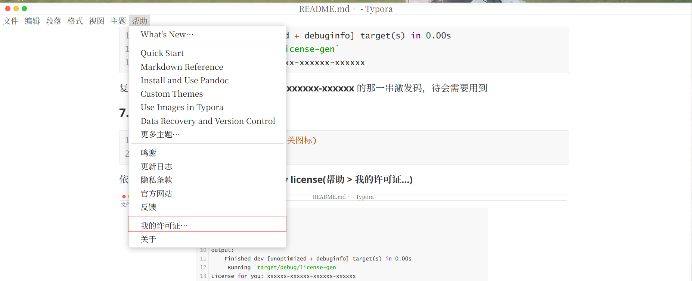
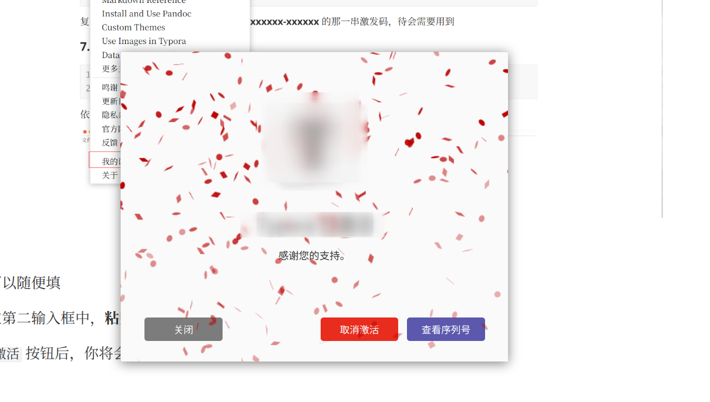

## TYpora最新版激发教程

> Yporainject（[Copy from repo NodeInject](https://github.com/DiamondHunters/NodeInject)）

> **[see the README of that repo](./NodeInject_README.md)**
>
> 作者：叶月绘梨依
> 日期：2023年6月10日
---

#### 1. 下载最新版Typora安装包

- [前往TYPORA中文官网下载](https://typoraio.cn/releases/all)

- 在终端下输入以下命令直接下载(我电脑是X86架构的，请根据自己电脑自行选择)

  ```bash
  #查看电脑架构
  uname -m
  
  #下载TYPORA安装包
  #X86(amd)
  wget https://download2.typoraio.cn/linux/typora_1.6.6_amd64.deb --output-document typora.deb
  
  #ARM
  wget https://download2.typoraio.cn/linux/typora_1.6.6_arm64.deb --output-document typora.deb
  
  #安装TYPORA
  sudo dpkg -i typora.deb
  ```

  

#### 2. 克隆Yporaject项目

```bash
git clone https://github.com/hazukieq/Yporaject.git
```


#### 3.配置 rust 编译环境

由于编译项目需要 **rust** 的支持，所以我们需要配置相关环境(若已有，则可跳过该步骤)

```bash
#运行官方脚本安装即可
curl --proto '=https' --tlsv1.2 -sSf https://sh.rustup.rs | sh

#检查cargo，若看到如下版本信息，则说明配置成功
cargo -v
cargo 1.70.0 (ec8a8a0ca 2023-04-25)
```

注：若安装过程中出现其他问题，请自行网上搜索相关安装教程，关键字 `ubuntu ` `cargo  ` `rust`   `install`


#### 4. 编译Yopraject项目

```bash
#进入Yoprainject项目
cd Yporainject
#运行编译命令
cargo build
#查看二进制是否生成,程序名称为 node_inject
ls target/debug
#尝试运行该二进制程序
cargo run
output: 
no node_modules.asar found
move me to the root of your typora installation(the same directory as executable of electron)
```

请务必确认当前项目目录 **target/debug 下** 是否生成了 **node_inject 二进制程序**


#### 5. 复制二进制程序到安装目录下

```bash
#记录当前目录路径，待会返回需要用到
cur=`pwd`

#复制二进制程序到相关目录下
sudo cp target/debug/node_inject /usr/share/typora
#进入相关目录
cd /usr/share/typora
#给予二进制程序执行权限
sudo chmod +x node_Inject
#检查二进制程序是否可以运行
cargo run
```


#### 6. 获取许可证激发码

```bash
#返回项目
cd $cur
#进入 license-gen 文件夹
cd license-gen
#编译代码
cargo build
#运行二进制程序
cargo run
#你将会得到以下输出
output:
    Finished dev [unoptimized + debuginfo] target(s) in 0.00s
     Running `target/debug/license-gen`
License for you: xxxxxx-xxxxxx-xxxxxx-xxxxxx
```

复制 **License for you: xxxxxx-xxxxxx-xxxxxx-xxxxxx** 的那一串激发码，待会需要用到

#### 7. 激活软件

```bash
#运行TYPORA(你也可以在桌面上点击相关图标)
typora &
```

依次点击界面上方菜单栏选项 **help > my license(帮助 > 我的许可证...)** 







邮箱可以随便填

然后在第二输入框中，**粘贴刚才得到的激发码**

点击 `激活` 按钮后，你将会看到以下界面





#### 结语

经过几番查找，好多教程都不怎么符合我的需求，且在 `CSDN` 等平台上各种转载、胡乱复制的帖子...看得真是心累。不知是不是由于我用的软件比较新的缘故， 比如 **poraCracker 就没有用。后面看到了NodeInject这个项目，我抱着尝试的态度按照项目指南操作，没想到竟然真的激活成功了。为了以后自己能想起这个方法，特此记录。


##### 参考文献

1. [**(Linux/Windows) Typora 理论多版本兼容破解方案**](https://www.52pojie.cn/thread-1710146-1-1.html)
2. [RUST 安装](https://www.rust-lang.org/zh-CN/learn/get-started)
